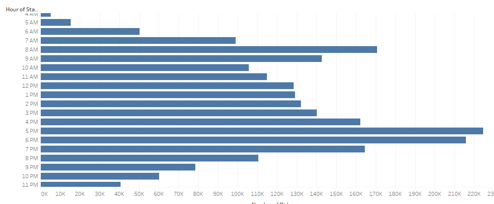

# bikesharing

## Resources

Tableau Public 2021.1, CSV of Citi Bike ride data from August 2019

## Overview

Inspired by the success of bikesharing services across the country, a client wishes to start a bikesharing company in Des Moines, Iowa.  To gain some insights in preparation to start this business, the client requested visualizations of data collected by Citi Bike in New York City for the month of August, 2019.  From these visualizations the client wants to gain insights into whether gender affects ridership, want times of day and what days of week are the busiest, and thus what riders are likely using the bikes for.  This will help the client target and scale their business in Des Moines.

I used Tableau Public to create a story from the visualizations requested.  Images of the visuals used are copied below, and the full Tableau Story can be viewed [here](https://public.tableau.com/profile/michael.hertel#!/vizhome/NYCCitiBikeChallenge_16181110490760/Story1).

## Results

- User Type

As can be seen in the bar graph below, the vast majority of rides in New York City were taken by subscribers to the service, while far fewer were taken by riders who do not have a subscription.

This indicates that the client should offer a subscription as part of their service, and they should focus their promotional energy on getting people to subscribe.
- User Gender

Most of the riders in NY were male, while a only about a quarter were female.  A small portion did not report their gender.

This indicates the client in Des Moines should focus promotions on getting male subscribers.

- Trip Length
    - All users

    The following visualization shows that most trips are less than an hour in length, and in fact the majority of those rides are only a few minutes long.  (Note, when viewing the interactive visualization in Tableau the graph can be filtered by hour of duration, ie 0 hours and x minutes, 1 hour and x mintes, etc.) Hundreds of thousands of rides lasted less than an hour, while fewer than 1,000 rides were between 1 and 2 hours, with each subsequent hour accounting for fewer rides after that.

    

    The relatively short trip duration means the client in Des Moines means the number of bikes needed, even during peak hours, will be relatively low, as most bikes will be able to be used by multiple clients per hour.

    - Effect of Gender
    
    The client wanted to know if gender seemed to affect the other factors such as trip length.  The below visualization breaks down trip length by gender.  While males do account for most rides, trip length seems to follow the same pattern as above regardless of the rider's gender

    

- Trip Purpose

    The client wanted insights into the likely uses of bikes by customers, so I created visualizations showing what time of day and what days of the week accounted for the most rides, to see if that could provide insight.

    - Time of Day

    Trip start times are much higher during the daytime, with the peak times being between 7:00 and 9:00 A.M. and 5:00 and 6:00 P.M.  This indicates that a large portion of riders are using the bikes to commute to and from work.
    

    
    
    - Day of the Week

    I broke down the start times by day of week as well with the below heatmap.  Here, the same peak hours show to be true on the weekdays, with fewer rides in general happening on weekends.
    
    

    - Effect of Gender
    
    As with trip length, when viewing the weekday data according to gender, riders seem to follow the same pattern of peak usage regardless of gender.  Note, because so many more males ride than females or unknown, when viewing each gender side by side in the interactive visualization, the color scaling is difficult to see for females.  The pattern becomes much clearer when viewing genders one at a time.

    
     
    
    
    - Effect of User Type

    While gender does not seem to affect the purpose of the ride, when charting subscribers along side non-subscribers (similarly viewed one at a time for color grading) the heat maps show that subscribers use bikes for work commuting during the week, while the occasionaly rider who does not subscribe is more likely to ride on the weekend.
    
    
    

- Trip Location

## Summary

